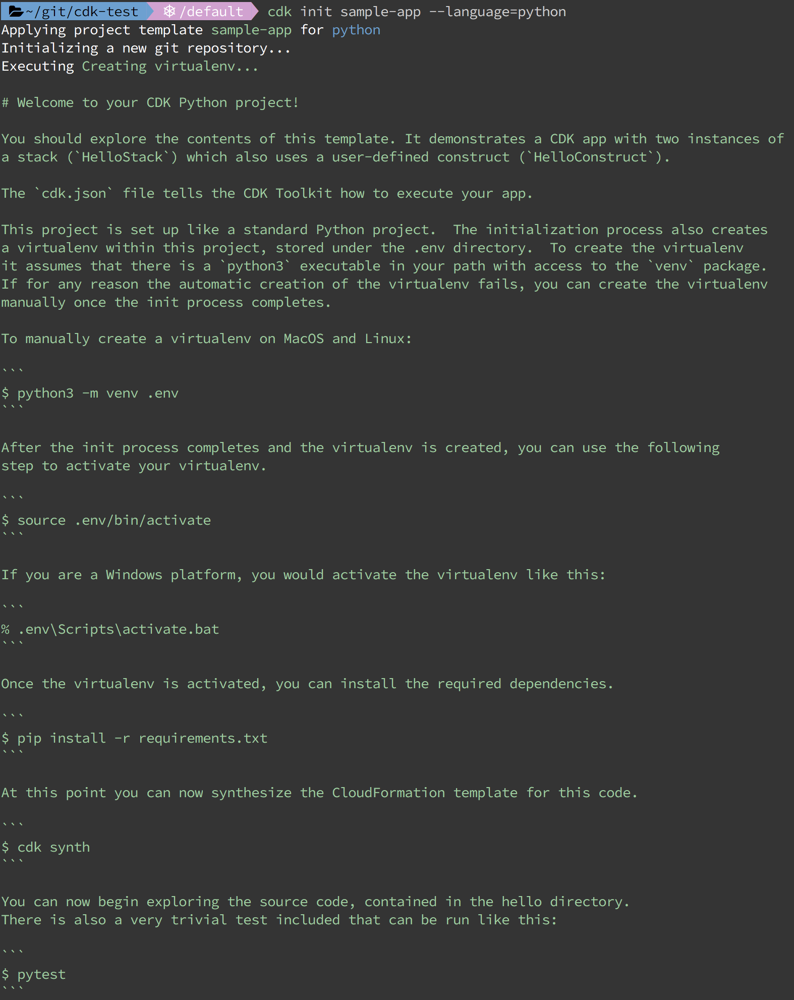
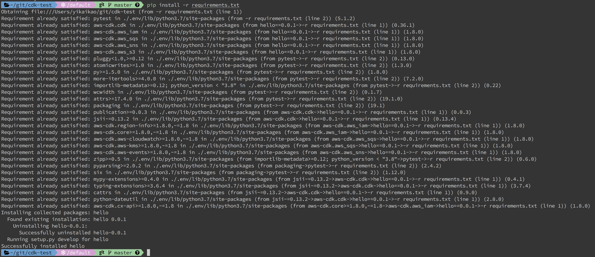
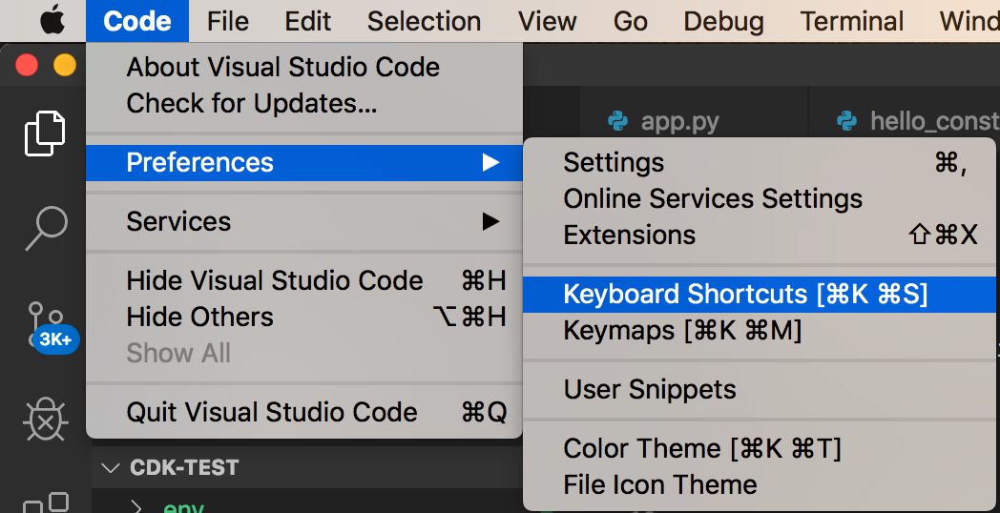
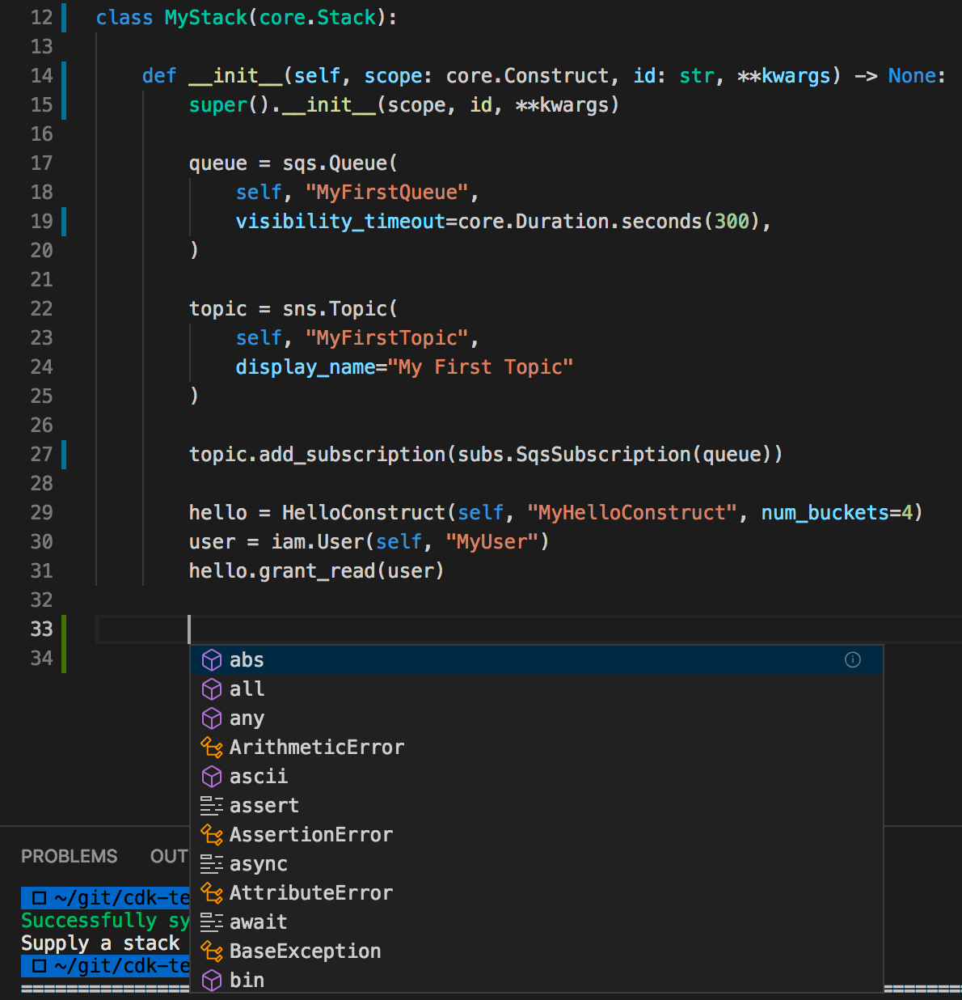

# Prepare your AWS CDK environment

## Install AWS CLI

In case you don't have AWS Command Line Interface (CLI) installed, please refer to the instructions to intall.

https://docs.aws.amazon.com/cli/latest/userguide/cli-chap-install.html

## Install AWS CDK CLI

Install or update the AWS CDK CLI from npm [(requires Node.js >= 8.11x)](https://nodejs.org/en/download/):

```bash
$ npm i -g aws-cdk
```


check the cdk version to verify installation success, the version should be + aws-cdk@1.8.0

## Create an AWS CDK test project

We'll walk through by a sample project to install some useful IDE and extensions to have better development experience. In this workshop we are developing aws-cdk python application, please make sure you have installed python3 ( >= 3.6) with pip3 interpreter accordingly.

```bash
# create a test folder as below, or name it whatever you want.
$ mkdir cdk-test
$ cd cdk-test
# create the aws cdk project by init sub-command and sample application, specify the language as python
$ cdk init sample-app --language=python
```





Activate the python environment, and install all of the required libs by pip.

```bash
$ python3 -m venv .env
$ source .env/bin/activate
$ pip install -r requirements.txt
```




## Install Visual Studio Code

We'll take Visual Studio Code to walk you through CDK labs, install and configure it as the following steps.

The following instructions is fully new installation, if you had did it, then just skip it.

### Download & Install

Recommand to download the Visual Studio code (vscode) from https://code.visualstudio.com/download.

Download anbd install the suitable distribution on your laptop.

### Install extensions

Click the extentions pannel, and install the following extensions.


After the python extension is installed, when you open any .py file in vscode,  will also ask you to install Linter pylint. 


Please install for code assistence directly or manually install it:

```bash
$ source cdk-test/.env/bin/activate                           
$ cdk-test/.env/bin/python3 -m pip install -U pylint
```


### Test project

Run the test to see if any error is occured, if no, now you are ready to explore the AWS CDK python world.

- Check the unit test 

```bash
$ pytest
```

- generate cloudformation json file

```bash
cdk synth
```


### Enable Trigger Suggest

The best way to have developing productivity is enable vscode trigger suggest, if the built-in shortcuts doesn't work for you, just open preferences panel by: 

 Code --> Preferences --> Keyboard Shortcuts



Then, search for : trigger and edit.


Finally, you could have the intelligence suggestion by hitting the shortcuts.

